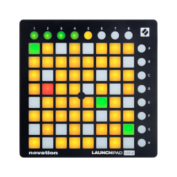

# Launchpad

## What is it ?

This project is designed to experiment with the `Novation Launchpad Mini` [MIDI](https://en.wikipedia.org/wiki/MIDI) protocol.

This project is based on the excellent cross-platform [RtMidi](https://www.music.mcgill.ca/~gary/rtmidi/) library and is written in C++14 for Linux, but it should compile and run on BSD without any change.

## Supported models

The project has only been tested with the `Launchpad Mini MK2` but should work with the original `Launchpad` and `Launchpad Mini MK1`.



## Disclaimer

This project is absolutely not affiliated with [Novation](https://novationmusic.com/) or [Focusrite](https://focusrite.com/).

It has been developed according to the programmer reference made available by Novation. You can find a copy of this reference in the `doc` directory.

## License

This project is availaible under [GNU General Public License, version 2](https://www.gnu.org/licenses/old-licenses/gpl-2.0.html).

```
This program is free software: you can redistribute it and/or modify
it under the terms of the GNU General Public License as published by
the Free Software Foundation, either version 2 of the License, or
(at your option) any later version.

This program is distributed in the hope that it will be useful,
but WITHOUT ANY WARRANTY; without even the implied warranty of
MERCHANTABILITY or FITNESS FOR A PARTICULAR PURPOSE.  See the
GNU General Public License for more details.

You should have received a copy of the GNU General Public License
along with this program.  If not, see <http://www.gnu.org/licenses/>.
```

## How to build and install

### Preamble

This project is fully [autotoolized](https://en.wikipedia.org/wiki/GNU_Autotools), so it is simple to build and install it with the traditional commands `configure`, `make` and `make install`.

### Install the dependencies

Under Debian or derivatives (Ubuntu, Mint, ...), you should install these dependencies. On the other distros, please install the equivalent packages.

Build tools:

```
build-essential
```

Build dependencies:

```
librtmidi-dev >= 3.0.0
```

### Generate the configure script

If the `configure` script is not present, you must generate it. This the case if you are cloning the git repository.

Before generating the `configure` script, you must ensure you have the following packages installed on your system:

```
autoconf
automake
libtool
```

If everything is installed, you just have to run this command:

```
autoreconf -v -i -f
```

And voilà ! The configure script is now available and usable.

### Configure the project

Run the `configure` script

```
./configure --prefix={destination-path}
```

The prefix is used to inform the build system where to install the project.

### Build the project

If the source configuration has done without any error, you can now build the project with `make`:

```
make
```

You can build in parallel if you have a multiple cpu cores on your machine: 

```
make -j${NUMBER_OF_PROCESSES}
```

Ajust the `NUMBER_OF_PROCESSES` with this rule of thumb: `NUMBER_OF_PROCESSES = NUMBER_OF_CPU + 1`.

Example for a 4 cores CPU:

```
make -j5
```

### Install the project

This step is optional and can require `root` permissions.

```
make install
```

If everything is ok, the project is now installed on your system.

You can find the executable into the `${destination-path}/bin` directory.

## How to run

### Preamble

If you have installed the project, you can find the executable in the `${destination-path}/bin` directory. In the other case, the executable is located in the `./src/launchpad` directory

### Usage

```
Usage: launchpad [OPTIONS]

    -h, --help                  display this help
    -l, --list                  list available MIDI ports

    --cycle                     cycle colors
    --print={text}              print a text
    --scroll={text}             scroll a text
    --game-of-life={pattern}    Conway's game of life

    --delay={value[us|ms|s|m]}  delay (ms by default)

    --midi={port}               MIDI input/output
    --midi-input={port}         MIDI input
    --midi-output={port}        MIDI output

MIDI input:

  - Launchpad Mini

MIDI output:

  - Launchpad Mini

```

### List available MIDI peripherals

You can list all MIDI peripherals with the `-l` or the `--list` options:

```
launchpad -l
```

or

```
launchpad --list
```

Outputs example:

```
Available MIDI inputs :

[I] Midi Through:Midi Through Port-0 14:0
[I] Launchpad Mini:Launchpad Mini MIDI 1 20:0

Available MIDI outputs :

[O] Midi Through:Midi Through Port-0 14:0
[O] Launchpad Mini:Launchpad Mini MIDI 1 20:0

```

### Select a specific MIDI peripheral

By default, the utility will use the string `Launchpad Mini` to find a usable Launchpad.

But you can select a specific MIDI peripheral by using `--midi`, `--midi-input`, `--midi-output` options.

The utility will use each provided string like a prefix to compare with all available inputs/outputs and will choose the first match.

Example:

```
launchpad --midi="Launchpad Mini:Launchpad Mini MIDI 1"
```

### Cycle application

You can cycle all colors with this command:

```
launchpad --cycle [--delay={value[ms|s|m]}]
```

### Print application

You can print a text with this command:

```
launchpad --print={text} [--delay={value[ms|s|m]}]
```

### Scroll application

You can scroll a text with this command:

```
launchpad --scroll={text} [--delay={value[ms|s|m]}]
```

### GameOfLife application

You can run a Conway's Game of Life with this command:

```
launchpad --game-of-life={pattern} [--delay={value[ms|s|m]}]
```

The pattern value can be:

  - `random` for a random pattern
  - `slider` for a slider pattern
